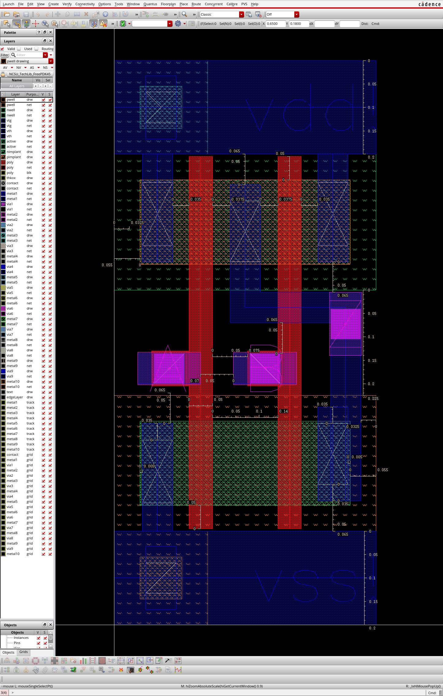
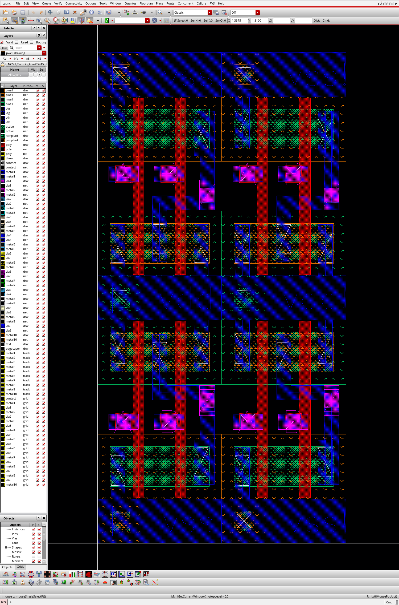

# ECE 425: mp1 GUIDE

**This document, GUIDE.md, serves as a gentle, guided tour of the MP. For strictly the specification and rubric, see [README.md](./README.md).**

## Example Cell

Here is a example of a detailed screenshot of a clean and compact drawing of NAND2:



## In a Row?

The end goal of this MP is to leave you with cells that you can lego block together to form more complex design,
hence the name standard cell. All standard cells should be able to fit together with no gaps,
with contiguous wells, and of the same height. Here is an example of four such NAND2 in two rows:



200nm power rail is a arbitrary number we choose for this MP. In reality they are usually thinner.

It is also worth mentioning that well tap are usually not included in normal logic cells,
rather, well tap are their own standard cells that will be placed separately.
For this MP, without doing well tap in cell, LVS will not be very happy.

## Source/Drain Merging

In the above example, you can see that the NMOS is using a contiguous active/nimplant region,
missing one of the middle terminal of the NMOS in series. Since the active/nimplant region is conductive,
and the middle terminal is not used, we can safely left it out.

You can also see that the drain of the PMOS are merged. Since they are in parallel,
we can choose either the source or the drain to be merged.
We cannot merge both because the gate will be very hard to route.

## Transistor Sizing

Recall that the resistance of a material is proportional to its width and inversely proportional to its length.
Transistor in parallel can be considered to be a single transistor with their width summed,
while transistor in series can be considered to be a single transistor with their length summed.

To ensure your cell have a not so bad timing characteristic,
you have to size your NMOS and PMOS so that they have the desired resistance.
We are to make sure the worst case equivalent resistance from VDD to Z and VSS to Z are equal to the smallest NMOS.
The reason that we say worst case is because, sometimes transistors can be in "parallel",
but they might or might not be active at the same time. Consider the PMOS in NAND2,
it could be the case that only one input is low, or both is low.
The worst case here is that only one is low, thus we size both PMOS to be 180nm
so either PMOS can drive like a 90nm NMOS.

## Tips for Compact and Clean Design

Most of the time poly should be vertical only.

Use a lot of rulers while drawing.

Draw the tallest cell first, so that you can use this height for other cells.

Use M1 primarily vertically, and M2 primarily horizontally.

Have `/class/ece425/FreePDK45/ncsu_basekit/techfile/calibre/calibreDRC.rul`
opened on the side so you can check the rule while you draw.

A good technique to draw compact cells with as many S/D merged is to try to trace all the (N-side)
transistors with one line without lifting your pen. Here is a example:


Then you use other method to connect the reset of the connection.

When there are multiple possible way to trace, try to find the better one.

## Tar?
```bash
$ tar -cf ece425mp1_<netid>.tar ece425mp1_<netid>
```
